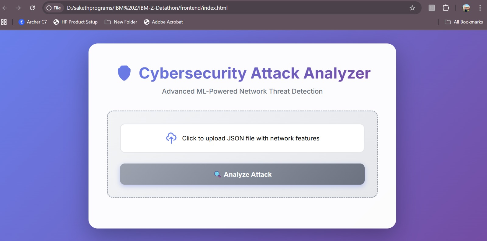
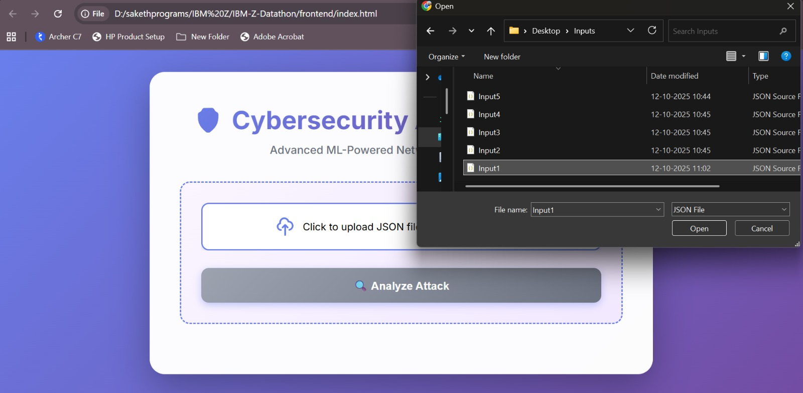
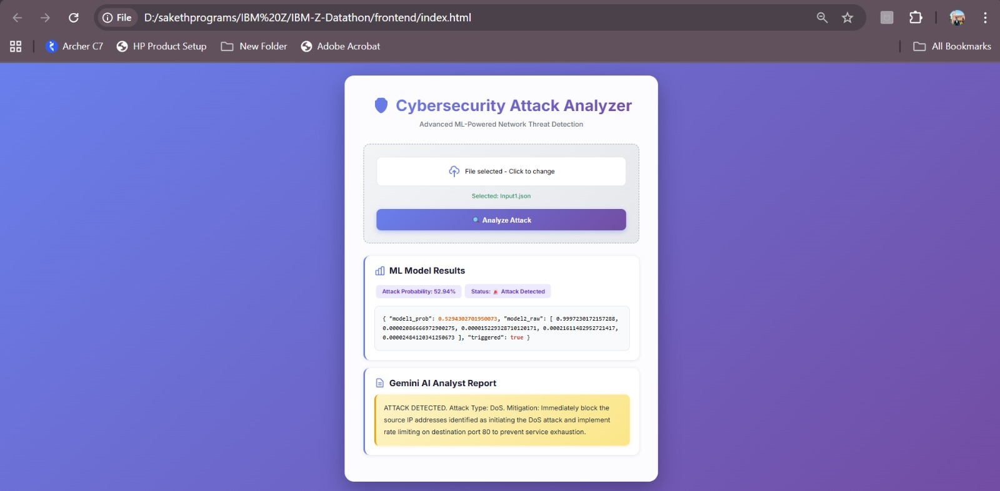

# 🛡️ IBM-Z-Datathon - ThreatScopeAI

[](https://www.python.org/)
[](https://flask.palletsprojects.com/)
[](https://www.tensorflow.org/)
[](LICENSE)

## 🌟 Overview

An advanced **ML-powered cybersecurity threat detection system** that combines deep learning models with Google Gemini AI to analyze network traffic, detect attacks, and provide actionable insights. The system features a beautiful, modern web interface for easy interaction and real-time threat analysis.

### ✨ Key Features

- 🤖 **Dual ML Pipeline**: Binary attack detection + Multiclass attack classification
- 🧠 **AI-Powered Reports**: Google Gemini LLM generates comprehensive threat analysis
- 🎨 **Beautiful Web UI**: Modern, responsive frontend with gradient design
- 📊 **Real-time Analysis**: Upload JSON files and get instant attack predictions
- 🔒 **5 Attack Categories**: DoS, Normal, Probe, R2L, U2R classification
- 📈 **Visual Metrics**: Color-coded results with attack probability indicators

---

## 🎨 User Interface Preview

### Initial Upload Interface


_Beautiful gradient UI with intuitive file upload area_

### File Selection Dialog


_Easy JSON file selection with multiple test inputs available_

### Attack Analysis Results


_Real-time attack detection with ML model results and AI-generated insights_

---

## 📁 Project Structure

```
IBM-Z-Datathon/
│
├── backend/
│   ├── app.py                      # Flask REST API server
│   ├── best_model.h5               # Binary attack detection model (Keras)
│   ├── best_multiclass_model.h5    # Multiclass attack classifier (Keras)
│   ├── scaler1.gz                  # Feature scaler for model 1
│   ├── scaler2.gz                  # Feature scaler for model 2
│   ├── requirements.txt            # Python dependencies
│   └── venv/                       # Virtual environment (optional)
│
├── frontend/
│   ├── index.html                  # Beautiful web interface
│   ├── app.js                      # Frontend JavaScript logic
│   └── sample_input.json           # Example input file (78 features)
│
├── deep_learning_model/
│   └── IBM_final.ipynb             # Model training & development notebook
│
├── assets/                         # UI screenshots for documentation
│   ├── screenshot1.jpeg            # Upload interface
│   ├── screenshot2.jpeg            # File selection dialog
│   └── screenshot3.jpeg            # Analysis results
│
├── Sample Input/                   # Test input files
│   ├── Input1.json                 # Sample network traffic data 1
│   ├── Input2.json                 # Sample network traffic data 2
│   ├── Input3.json                 # Sample network traffic data 3
│   ├── Input4.json                 # Sample network traffic data 4
│   └── Input5.json                 # Sample network traffic data 5
│
├── LICENSE                         # MIT License
└── README.md                       # This file
```

---

## 🚀 Getting Started

### Prerequisites

- Python 3.8 or higher
- pip package manager
- Modern web browser (Chrome, Firefox, Edge, Safari)

### Installation

1. **Clone the repository:**

   ```bash
   git clone https://github.com/harshilkgp/IBM-Z-Datathon.git
   cd IBM-Z-Datathon
   ```

2. **Set up the backend:**

   ```bash
   cd backend

   # Create virtual environment (optional but recommended)
   python -m venv venv

   # Activate virtual environment
   # On Windows:
   venv\Scripts\activate
   # On macOS/Linux:
   source venv/bin/activate

   # Install dependencies
   pip install -r requirements.txt
   pip install flask-cors
   ```

3. **Verify model files exist:**
   Ensure these files are in the `backend/` directory:
   - `best_model.h5`
   - `best_multiclass_model.h5`
   - `scaler1.gz`
   - `scaler2.gz`

---

## 🎮 Usage

### Starting the Backend Server

```bash
cd backend
python app.py
```

You should see:

```
 * Running on http://127.0.0.1:5000
Models and scalers loaded successfully.
```

### Using the Web Interface

1. **Open the frontend:**

   - Navigate to `frontend/index.html` in your browser
   - Or simply double-click `index.html`

2. **Upload a JSON file:**

   - Click the upload area
   - Select a JSON file with network features (see format below)
   - Or use the provided `sample_input.json`

3. **Analyze:**
   - Click "🔍 Analyze Attack"
   - View beautiful, color-coded results with AI-generated insights

### Expected JSON Format

```json
{
  "features": [
    80, 3, 2, 0, 0, 0, 0, 0, 0, 0, 0, 0, 0, 0, 0, 1000000, 2, 0, 2, 2, 2, 2, 0,
    2, 2, 0, 0, 0, 0, 0, 0, 0, 0, 0, 0, 64, 0, 1000000, 0, 0, 0, 0, 0, 0, 0, 0,
    0, 0, 1, 0, 0, 0, 0, 0, 0, 0, 64, 0, 0, 0, 0, 0, 0, 2, 0, 0, 0, 251, -1, 0,
    32, 0, 0, 0, 0, 0, 0, 0
  ]
}
```

**Note:** The features array must contain exactly **78 numerical values** representing network flow characteristics.

---

## 🔌 API Endpoints

### 1. Health Check

```
GET /
```

Returns server status message.

### 2. Sample Prediction

```
GET /predict_random
```

Runs analysis on hardcoded sample data (for testing).

**Response:**

```json
{
  "ml_pipeline_results": {
    "model1_prob": 0.5530790090560913,
    "triggered": true,
    "model2_raw": [0.978, 0.021, 0.0, 0.0, 0.0]
  },
  "gemini_analyst_report": {
    "output": "ATTACK DETECTED. Probable attack type: Denial of Service (DoS). Immediate mitigation: Implement rate limiting on network devices..."
  }
}
```

### 3. Custom Prediction

```
POST /predict
Content-Type: application/json

{
  "features": [78 numerical values]
}
```

**Response:** Same as above, with analysis and prediction for your specific data.

---

## 🧪 Machine Learning Pipeline

### Model 1: Binary Attack Detector

- **Type:** Neural Network (Keras/TensorFlow)
- **Purpose:** Detects if network traffic is malicious
- **Output:** Probability score (0-1)
- **Threshold:** 0.5 (triggers Model 2 if exceeded)

### Model 2: Multiclass Classifier

- **Type:** Neural Network (Keras/TensorFlow)
- **Purpose:** Categorizes attack types
- **Classes:**
  1. DoS (Denial of Service)
  2. Normal
  3. Probe
  4. R2L (Remote to Local)
  5. U2R (User to Root)

### Gemini AI Integration

- **Model:** gemini-2.5-flash-preview
- **Purpose:** Generate human-readable threat reports
- **Output:** Attack summary + mitigation recommendations

---

## 🎨 Frontend Features

- **Modern Design:** Gradient backgrounds, glass-morphism, smooth animations
- **Drag & Drop:** Intuitive file upload interface
- **Loading States:** Spinner animation during analysis
- **Color-Coded Results:** Visual distinction between safe/unsafe traffic
- **Syntax Highlighting:** JSON results with color-coded values
- **Responsive Layout:** Works on desktop, tablet, and mobile
- **Error Handling:** User-friendly error messages

---

## 📊 Notebooks

### `IBM_final.ipynb`

Model development workflow:

- Exploratory Data Analysis (EDA)
- Model architecture design
- Training and validation
- Performance metrics evaluation
- Model export to `.h5` files

---

## 🔧 Technologies Used

### Backend

- **Flask** - Web framework
- **TensorFlow/Keras** - Deep learning
- **NumPy** - Numerical computing
- **Scikit-learn** - ML utilities
- **Joblib** - Model serialization
- **Requests** - API calls to Gemini

### Frontend

- **HTML5** - Structure
- **CSS3** - Styling (gradients, animations)
- **JavaScript (ES6+)** - Interactivity
- **Fetch API** - Backend communication

### AI/ML

- **Google Gemini AI** - Natural language generation
- **Custom Neural Networks** - Attack detection/classification

---

## ⚙️ Configuration

### Environment Variables (Optional)

For production deployment, set these in your environment:

```bash
export GEMINI_API_KEY="your_api_key_here"
export FLASK_ENV="production"
export FLASK_PORT=5000
```

Then update `app.py`:

```python
GEMINI_API_KEY = os.getenv("GEMINI_API_KEY")
```

### CORS Settings

CORS is enabled for all origins (development mode). For production:

```python
CORS(app, resources={r"/*": {"origins": ["https://yourdomain.com"]}})
```

---

## 🐛 Troubleshooting

### "Failed to fetch" error

- ✅ Ensure backend is running (`python app.py`)
- ✅ Check console for errors (F12 in browser)
- ✅ Verify CORS is enabled in `app.py`

### Import errors

- ✅ Activate virtual environment: `venv\Scripts\activate`
- ✅ Install dependencies: `pip install -r requirements.txt`
- ✅ Install flask-cors: `pip install flask-cors`

### Model loading errors

- ✅ Check that all `.h5` and `.gz` files exist in `backend/`
- ✅ Verify file permissions
- ✅ Ensure TensorFlow is properly installed

---

## 📝 License

This project is licensed under the MIT License - see the [LICENSE](LICENSE) file for details.

---

## 👥 Contributors

- **Harshil KGP** - [@harshilkgp](https://github.com/harshilkgp)

---

## 🙏 Acknowledgments

- IBM Z Datathon organizers
- Google Gemini AI team
- TensorFlow/Keras community
- Open-source contributors

---

## 📧 Contact

For questions or support, please open an issue on GitHub or contact the repository owner.

---

<p align="center">Made with ❤️ for IBM Z Datathon</p>
